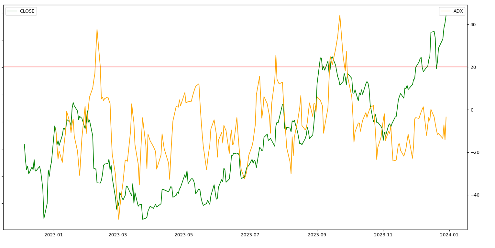
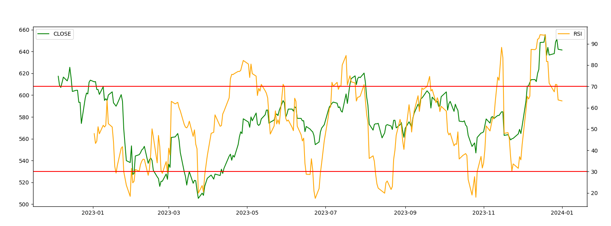
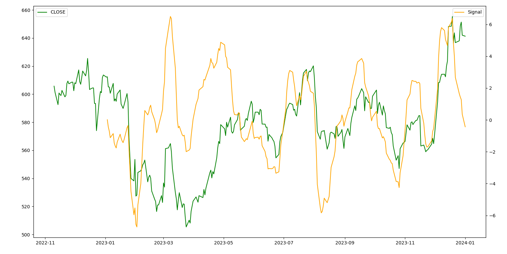
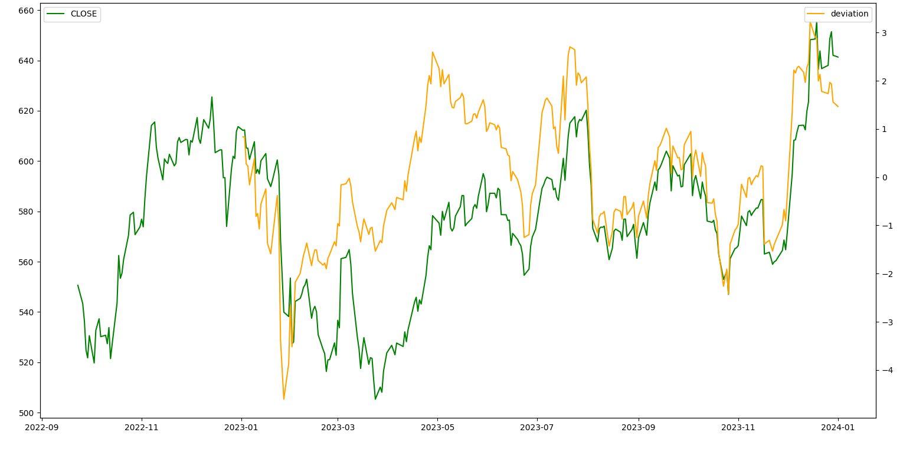

# COP290A1_subtask3

## Graphs patterns for different strategies
### ADX
    For adx we plotted the value of adx and the stock price aganist date for TATASTEEL for the whole year of 2023 and observed the following graph
    
    In the graph we observe that even in feburary when there is a string decreasing trend ADX rises above the threshold(the red line) in fact ADX seems to cross threshold for all regions of very strong increase and decrease. Hence ADX is not a measure of whether one should buy or sell a stock but a measure of when the increasing or decreasing trend in the market is particularly strong. Hence it is more useful to use ADX in conjunction with some other trading strategy where trades are made only above ceratin ADX thresholds. This would prevent rapid buy and selss which occur when there are smaller fluctuations which lead to neglegible profits or losses.

### RSI
    For RSI we plotted the value of rsi and the stock price against date for SBIN for the whole year of 2023.
    
    In the graph we observe that in periods of strong decline in the stock price like between january and march RSI drops below the minimum threshold, in periods of large price increase like may we observe that RSI goings above the maximum threshold. This makes intuitive sense with how we defined RSI = 100*(avgGain)/(avgGain+avgLoss). Here the denominator mainly ensures RSI stays in a fixed range i.e is normalized. However as seen in the graph atleast for SBIN we observe that RSI seems to cross our threshold only after most of the price change has occured hence it may make sense to lower these thresholds to 60 and 40 to better reflect these price trends.

### MACD
    For MACD we plotted the difference betweeen MACD and signal for SBIN along with its price for the year 2023.
    
    Here MACD-Signal being greater than zero denotes a buy signal and less than zero denotes a sell signal. 
    Here too we see that in regions of high price drop like in january april phase our graph generates a sell signal as expected. However in march when there is a slight increase in price it also generates a buy signal despite the price drop that follows. This can be compensated for by using RSI in conjuction with this metric. RSI in this period stays well within its boundaries showing us that this price trend is not very strong.

### DMA
    For DMA we plotted how far the curPrice is fromt the running mean for SBIN along with its price for the year 2023.
    
    Here 
    Here the deviation curve seems to follow a similar trend to MACD accurately reflecting larger price changes while at the same time it is less affected by smaller prrice changes like in March where MACD seemed to spike while DMA stays moderate. Hence DMA in this cicrumstance would probably not be signinficantly improved by the addition of RSI.

### Optimizations performed
#### DMA calculation
    For DMA caluclation where we have to calculate the mean and standard deviation of n stock prices we used a sliding window method to keep track of the sum of the current stock prices and the sum of squares of the current stock prices instead of simply reading n prices and adding up them naively.
    (Interesting observation here:
    Initially we were comparing the current price and current average price by using curPrice > (1+p/100)*curAvgPrice but this gave incorrect results on some days hence we replaced with curPrice > curAvgPrice + curAvgPrice/100 which gave us correct results. We had assumed that since p/100 would only inlvove division by 100 and curPrice would be about a thousand hence the error involved here woludn't be sufficient to cause a difference. Clearly this was not the case. We observed something similar for ADX too.)
####  Basic strategy calculation
    Again the strategy is superficially similar to DMA hence we used a similar approach with sliding windows to keep track of whether the price has been increasing or decreasing and for how many days. This ensured we only had to read one new price value every day insteasd of reading n.
#### Inverse calculation in linear regression
    We used Gauss Jordan method to calculate the inverse of the matrix involved. We prefred this over the adjoint determinant method we learnt in lower classes because it was both faster and simpler. We didn't shift to using a more numerically stable algorithm as our prices would olny have to be correct to two decimal places and the matrix involved was 8x8 hence the number of floating point divisions which are our main cause for error was relatively small.
#### Best of all approach
    To ensure we didn't use waste space we used the same table of prices for all strategies ensuring it was large enough to have the data requested by different strategies(different strategies required different start dates.)
    (Interesting Observation: We first implemented the best of all approach for all strategies except linear regression. The running time for this seemed to be about 30% better than simply running all strategies sequentially. However once we added the linear regression strategy which took much longer than all the other strategies, the multithreaded and sequential approaches seemed to take the same amount of time on average with the multi threaded approach being slower than sequential in many cases. We assumed this was because the training period of linear regression was reading data from different locations from the rest of the strategies hence wasn't able to read from the cache slowing it down. But even when we separated out the training part of the strategy and ran the prediction part in parallel with the rest of the strategies there was no significant improvement.)